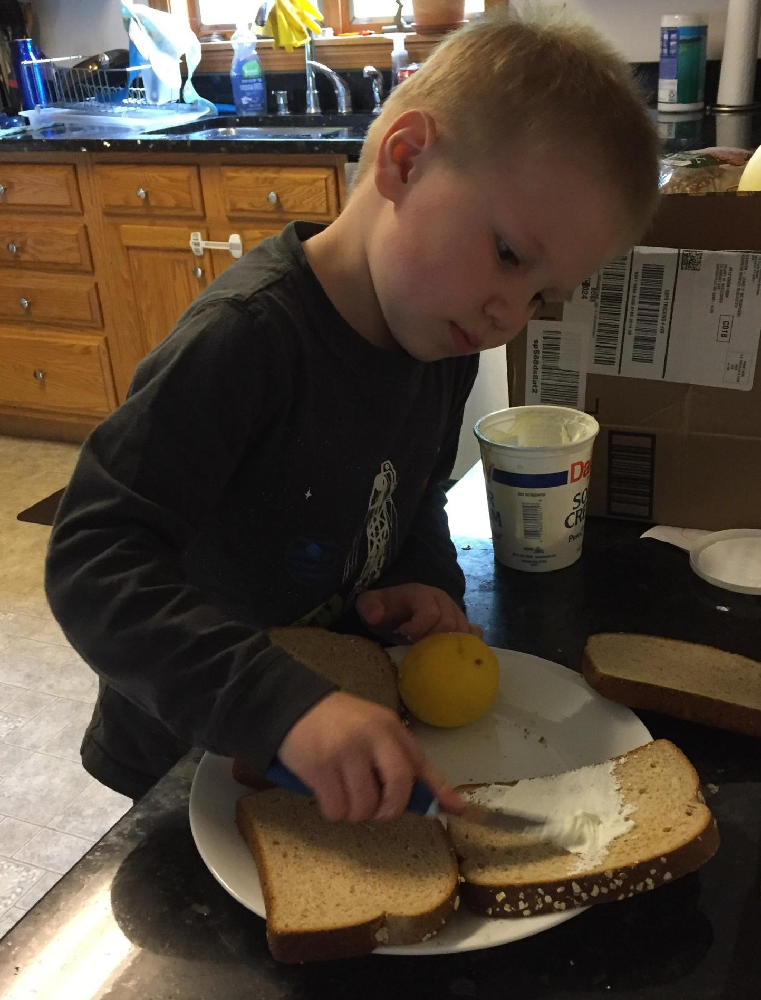
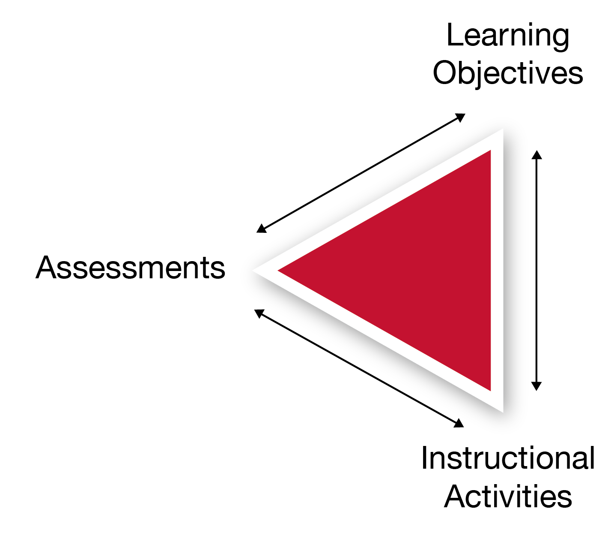
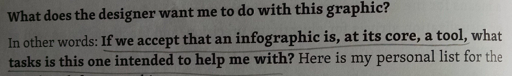
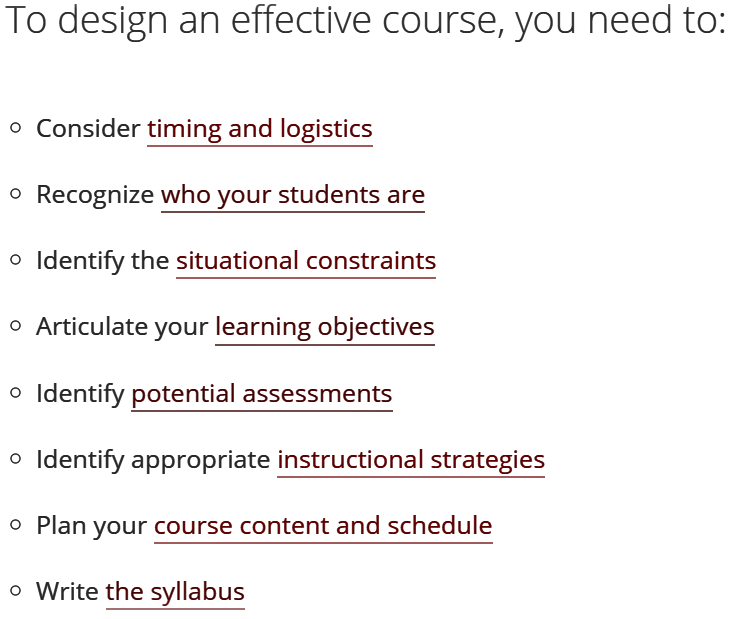
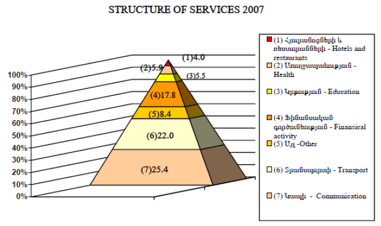

```{r setup, include=FALSE}
```


## tl;dr




## Goals for today

- See how the "alignment triangle" can help us design better dataviz courses

{width=150px}

- Know where to find dataviz ed resources for your own courses
    - https://github.com/civilstat/SDSS-2019-DatavizEd  
    has these slides, course syllabi, assignments, and grading rubrics


## Learning objectives for dataviz students?

* Principles of effective data visualization?
* Wrangling data?
* Statistical concepts?
* Implementing dataviz in particular software?
* Extending dataviz software, computer graphics, ...?
* Graphic design, interaction design, communication, ...?
* Dataviz research?
* ...


## Learning objectives for dataviz students?

* **Principles of effective data visualization**
* Wrangling data?
* Statistical concepts?
* Implementing dataviz in particular software?
* Extending dataviz software, computer graphics, ...?
* Graphic design, interaction design, communication, ...?
* Dataviz research?
* ...


## Some principles for explanatory dataviz

I want my students to go beyond "It's just a matter of taste" and reflect on the decisions they make.

* What should I graph?  
*(let form follow function, grammar of graphics...)*
* Can people read, understand, use my graphs?  
*(visual perception, cognition...)*



[Alberto Cairo, *The Functional Art*](http://www.amazon.com/gp/product/0321834739/ref=as_li_tl?ie=UTF8&amp;camp=1789&amp;creative=390957&amp;creativeASIN=0321834739&amp;linkCode=as2&amp;tag=civilstatis-20&amp;linkId=S2X4KWBUGLUVOWLL)


## Some principles for course design

{width=300px}

[Eberly Center for Teaching Excellence: "Design Your Course"](https://www.cmu.edu/teaching/designteach/design/index.html)


## Alignment in course design


[Eberly Center for Teaching Excellence: "Learning Objectives"](https://www.cmu.edu/teaching/designteach/design/learningobjectives.html)


## Counter-example: my **ineffective** Census Bureau course

* Target audience not clearly defined
* Weak learning objectives:  
"Learn to make these few nifty graphs"
* Instruction not aligned:  
"I'll demo some graphs in R, and you can follow along"
* Assessment not aligned:  
"Just let me know if you have Qs"


## Better examples: my Carnegie Mellon courses

At CMU, I taught roughly 3 audiences:

* Will make occasional dataviz, but it's not their focus
* Need solid dataviz skills, but also need basics of statistics and software
* Want to hone dataviz skills, but have other basics down


## Course design for brief-intro audience

Learning objectives:

>- Become aware that there are principles to be learned
- Use a few key principles to critique existing graphs
- Know where to find resources for learning more

Assessments:

>- Group discussion

Instruction:

>- Lecture slides with many rich examples
- Peer and group discussions


## Example slide for brief-intro audience

What works here? What does not, and why?




## Course design for principles-focused audience

Learning objectives:

>- Use key principles to critique and design effective dataviz
- Use **your choice of software** to create static and interactive graphics from **your data**
- Communicate your work to others

Assessments:

>- HWs with guided practice on skills and reflection on principles
- Static and Interactive Projects, to synthesize concepts and demonstrate design & communication -- allowing **revisions**

Instruction:

>- Lectures with many rich examples
- In-class "think-pair-shares," sketching, and coding exercises


## Rubrics for assessment

Divide the work into component parts, and describe what different levels of mastery look like for each.

- Communicates your expectations clearly
- Helps you grade open-ended work fairly and consistently
- Quick, broad feedback forces students to think as they revise


## Example: HW prompt

*Scientific American* states, "More women are entering college, which in turn is changing the relative popularity of disciplines."

Critique and remake the attached graphic.

* Explain what could be improved. Justify your criticism using ideas from visual perception research.
* Make 1-2 graphs that help answer these questions: *In what fields are more women entering college? How is each field's gender balance changing?*


## Example: partial HW rubric

|  | Competent | Not yet competent |
| ------------- | ----------------------------- | ----------------------------- |
| Grouping and Search | Elements to be compared are aligned. Distinct variables are mapped to separable dimensions. Choice of colors, shapes, etc. is easy to discriminate. | Elements to compare are not aligned. Distinct variables are mapped to integral dimensions (e.g. width and height). Distinct elements cannot be discriminated. |
|  |
| Cognition | Differences, proportions, or other important derived variables are plotted directly. Items are ranked by a meaningful variable. | User must compute differences, etc. mentally. Ranking is arbitrary or unhelpful for analysis (e.g. alphabetical). |


## Example: Graphic Design Project prompt

Choose a dataset to explore and summarize with a multi-part static graphic (e.g. web infographic or conference poster).

Find a story or message to convey using several graphs and text. Sketch several layout ideas, choose a visual style, and implement your multipart graphic (e.g. in Inkscape or Adobe Illustrator).


## Example: partial Project rubric

|  | Sophisticated | Competent | Not yet competent |
| ---------- | ------------------------ | ------------------------ | --------------------------- |
| Message | Multifaceted, clear message, strongly supported by text, graphs, annotations. | Simplistic but clear message. Text and graphs support the message adequately. | No message, or message is not at all supported by text and graphs. |
| |
| Layout | Alignment guides reader through graphic; Proximity groups related elements together and separates distinct groups. | Effective use of either Alignment or Proximity, though not both. Alignment is adequate within sections, but not across. | Haphazard Alignment and Proximity (no obvious grouping or separation; unclear which captions match which graphs). |


## Course design for thorough-intro audience

Learning objectives:

>- Use key principles to critique and design effective dataviz
- Use R's `ggplot2`, `shiny`, etc. to create static and interactive graphics
- Use R's `tidyverse` and `rmarkdown` to manipulate data and report results in a reproducible way
- Use statistical knowledge in graphics appropriately
- Communicate your work to others, in speech and in writing


## Course design for thorough-intro audience

Assessments:

>- RMarkdown Labs and HWs, with guided practice on skills and reflection on principles
- Static and Interactive Projects, to synthesize concepts and demonstrate design, communication, and collaboration
- Exam, to ensure individual accountability

Instruction:

>- Lectures with many rich examples
- In-class "think-pair-shares" and sketching exercises
- Lab practice and project-team checkins with TAs and instructor


## Example: in-class exercises

Scatterplots: discuss with a classmate...

* Here are the summary statistics for Anscombe's Quartet data. Sketch what you expect to see. Now here's the raw data. Sketch it -- does it look like what you expected?
* What plot of 1-D Continuous data did we generalize to get a 2-D scatterplot? How might we generalize a 1-D histogram into 2-D? Sketch some ways we could plot it.


## Example: Interactive Dataviz Project guidelines

Your Shiny app will earn a high grade if you...

- Tell a coherent story with your graphs (individually clear, well-made, & well-chosen; consistent design choices throughout), interactions, and supporting text
- Use an adequate variety of graph types and cite your sources
- Incorporate feedback from the draft critiques into your final app

Your writeup will earn a high grade if you...

- Give a clear overview of your dataset and main questions
- Explain how to read each graph and summarize takeaways
- Explain each interaction's main uses
- Explain why each graph/interaction was chosen over other possible alternatives


## Further resources

* Cairo, [*The Functional Art*](http://www.amazon.com/gp/product/0321834739/ref=as_li_tl?ie=UTF8&amp;camp=1789&amp;creative=390957&amp;creativeASIN=0321834739&amp;linkCode=as2&amp;tag=civilstatis-20&amp;linkId=S2X4KWBUGLUVOWLL): my favorite overview, written from a data journalism perspective
* Donahue, [*Fundamental Statistical Concepts in Presenting Data*](http://biostat.mc.vanderbilt.edu/wiki/pub/Main/RafeDonahue/fscipdpfcbg_currentversion.pdf): real case studies from a statistical consultant
* Williams, [*The Non-Designer's Design Book*](http://amzn.to/1UE37wk): best beginner's introduction to graphic design and typography I have seen
* Robbins, [*Creating More Effective Graphs*](http://www.amazon.com/gp/product/0985911123/ref=as_li_tl?ie=UTF8&camp=1789&creative=390957&creativeASIN=0985911123&linkCode=as2&tag=civilstatis-20&linkId=EV5MGPTGTILQU2JR): short, accessible summary of classic advice by Tufte and Cleveland; includes a graph design checklist
* Few, [*Show Me The Numbers*](http://www.amazon.com/gp/product/0970601972/ref=as_li_ss_tl?ie=UTF8&camp=1789&creative=390957&creativeASIN=0970601972&linkCode=as2&tag=civilstatis-20): examples in a business context; excellent advice on table design
* [Weissgerber et al. (2015):](http://journals.plos.org/plosbiology/article?id=10.1371/journal.pbio.1002128) article on showing all the data, not just statistical summaries

as well as

* Silas Bergen and Todd Iverson, [SDSS 2019 dataviz workshop](https://github.com/WSU-DataScience/SDSS19-dataviz-workshop)!


## Thanks!

{width=200px}

https://github.com/civilstat/SDSS-2019-DatavizEd  
has these slides, course syllabi, assignments, and grading rubrics

Contact:

- @[civilstat](https://twitter.com/civilstat)
- jerzy.wieczorek@colby.edu
